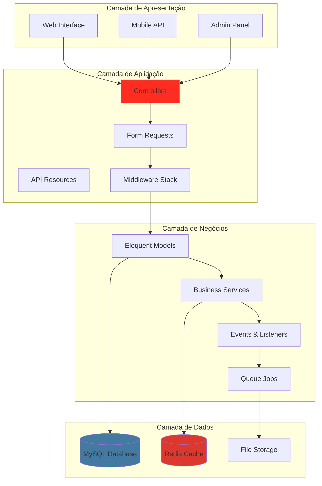
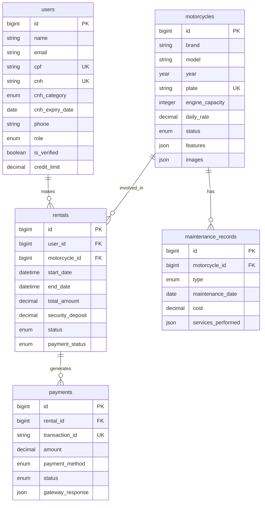

# Moto Rental Platform

<h1 align="center">
    
</h1>

<p align="center">
  
  
  
  
</p>

<p align="center">
  
  
  
  
</p>

<br>

<p align="center">
    <a href="README.md">English</a>
    ·
    <a href="README-pt.md">Português</a>
</p>

<p align="center">
  <a href="#bookmark-sobre">Sobre</a>&nbsp;&nbsp;&nbsp;|&nbsp;&nbsp;&nbsp;
  <a href="#rocket-tecnologias">Tecnologias</a>&nbsp;&nbsp;&nbsp;|&nbsp;&nbsp;&nbsp;
  <a href="#boom-recursos">Recursos</a>&nbsp;&nbsp;&nbsp;|&nbsp;&nbsp;&nbsp;
  <a href="#package-instalação">Instalação</a>&nbsp;&nbsp;&nbsp;|&nbsp;&nbsp;&nbsp;
  <a href="#memo-licença">Licença</a>
</p>

<br>

## :bookmark: Sobre

**Moto Rental Platform** é um sistema completo de gestão de locação de motocicletas desenvolvido com Laravel 11 e PHP 8.4, seguindo as melhores práticas de desenvolvimento de 2025. O sistema oferece funcionalidades abrangentes para gerenciamento de frota, reservas, clientes, pagamentos e manutenções, com foco em segurança, performance e escalabilidade.

### 🚀 **Novidades em 2025**

- **⚡ Laravel 11**: Framework PHP mais recente com estrutura simplificada
- **🔐 Laravel Sanctum**: Autenticação moderna para APIs e SPAs
- **📊 Laravel Horizon**: Monitoramento de filas em tempo real
- **🎨 Laravel Sail**: Ambiente de desenvolvimento Docker pronto para uso
- **🔒 Segurança Aprimorada**: Validação de documentos e controle de acesso granular
- **📱 API RESTful**: Endpoints bem estruturados para integração mobile
- **🧪 Testing Completo**: Cobertura total com PHPUnit e Laravel Dusk
- **⚡ Performance Otimizada**: Cache com Redis e índices de banco otimizados

### 🏗️ Visão Geral da Arquitetura



## :rocket: Tecnologias

Este projeto foi desenvolvido com as seguintes tecnologias:

- **[PHP 8.4](https://www.php.net/)** - Linguagem de programação
- **[Laravel 11](https://laravel.com/)** - Framework PHP
- **[MySQL 8](https://www.mysql.com/)** - Banco de dados relacional
- **[Redis](https://redis.io/)** - Cache e filas
- **[Docker](https://www.docker.com/)** - Containerização
- **[Laravel Sanctum](https://laravel.com/docs/sanctum)** - Autenticação de API
- **[Laravel Horizon](https://laravel.com/docs/horizon)** - Monitoramento de filas
- **[Laravel Telescope](https://laravel.com/docs/telescope)** - Debug e monitoramento

## :boom: Recursos

### Recursos Principais

#### 🏍️ Gestão de Motos
- Cadastro completo com marca, modelo, ano, placa
- Controle de status (disponível, alugada, manutenção)
- Upload de múltiplas imagens
- Histórico de manutenções
- Controle de quilometragem

#### 📅 Sistema de Locações
- Reservas online com disponibilidade em tempo real
- Cálculo automático de valores
- Sistema de caução e multas
- Controle de devolução
- Histórico completo

#### 👥 Gestão de Clientes
- Cadastro com validação de documentos (CPF, RG, CNH)
- Verificação de CNH válida e categoria
- Sistema de crédito/limite
- Histórico de locações
- Blacklist de clientes

#### 💰 Processamento de Pagamentos
- Múltiplos métodos (Cartão, PIX, Boleto)
- Integração com gateways
- Controle de status
- Sistema de reembolso
- Relatórios financeiros

#### 🔧 Manutenção e Controle
- Registros preventivos e corretivos
- Controle de custos
- Alertas automáticos
- Histórico de peças
- Agendamento de manutenções

### Estrutura do Banco de Dados



## :package: Instalação

### Pré-requisitos

- PHP 8.4+
- Composer 2.8+
- MySQL 8+
- Redis (opcional)
- Node.js 20+ (para assets frontend)

### Passo a Passo

1. **Clone o repositório**
```bash
git clone https://github.com/gabrielmaialva33/moto-rental-platform.git
cd moto-rental-platform
```

2. **Instale as dependências**
```bash
composer install
npm install
```

3. **Configure o ambiente**
```bash
cp .env.example .env
php artisan key:generate
```

4. **Configure o banco de dados no `.env`**
```env
DB_CONNECTION=mysql
DB_HOST=127.0.0.1
DB_PORT=3306
DB_DATABASE=moto_rental
DB_USERNAME=root
DB_PASSWORD=
```

5. **Execute as migrações**
```bash
php artisan migrate
```

6. **Inicie o servidor**
```bash
php artisan serve
```

### 🐳 Usando Docker

```bash
# Inicie os containers
./vendor/bin/sail up -d

# Execute as migrações
./vendor/bin/sail artisan migrate

# Acesse em http://localhost
```

## 📋 API Endpoints

### Autenticação
| Método | Endpoint | Descrição |
|--------|----------|-----------|
| POST | `/api/login` | Login de usuário |
| POST | `/api/register` | Registro de cliente |
| POST | `/api/logout` | Logout |
| GET | `/api/user` | Dados do usuário autenticado |

### Motos
| Método | Endpoint | Descrição |
|--------|----------|-----------|
| GET | `/api/motorcycles` | Listar motos disponíveis |
| GET | `/api/motorcycles/{id}` | Detalhes da moto |
| POST | `/api/motorcycles` | Cadastrar moto (admin) |
| PUT | `/api/motorcycles/{id}` | Atualizar moto (admin) |
| DELETE | `/api/motorcycles/{id}` | Remover moto (admin) |

### Locações
| Método | Endpoint | Descrição |
|--------|----------|-----------|
| GET | `/api/rentals` | Minhas locações |
| POST | `/api/rentals` | Criar locação |
| PUT | `/api/rentals/{id}/complete` | Finalizar locação |
| PUT | `/api/rentals/{id}/cancel` | Cancelar locação |

### Pagamentos
| Método | Endpoint | Descrição |
|--------|----------|-----------|
| POST | `/api/payments` | Processar pagamento |
| GET | `/api/payments/{id}` | Status do pagamento |
| POST | `/api/payments/{id}/refund` | Solicitar reembolso |

## 🧪 Testes

```bash
# Executar todos os testes
php artisan test

# Testes com cobertura
php artisan test --coverage

# Testes específicos
php artisan test --filter=MotorcycleTest
```

## 📊 Monitoramento

### Laravel Telescope
Acesse `/telescope` para monitoramento em desenvolvimento.

### Laravel Horizon
Acesse `/horizon` para monitoramento de filas.

## 🔒 Segurança

- Autenticação via Laravel Sanctum
- Validação de documentos (CPF, CNH)
- Rate limiting em APIs
- Prepared statements via Eloquent
- CSRF protection
- XSS protection
- Hashing de senhas com Argon2

## ⚡ Performance

- Cache com Redis
- Eager loading de relationships
- Índices otimizados no banco
- Queue jobs para tarefas pesadas
- Lazy loading de imagens
- CDN para assets (produção)

## 📈 Roadmap

- [ ] Aplicativo mobile (React Native)
- [ ] Sistema de GPS tracking
- [ ] Integração com WhatsApp
- [ ] Dashboard analytics avançado
- [ ] Sistema de fidelidade
- [ ] Múltiplas filiais
- [ ] Integração com seguradoras

## :memo: Licença

Este projeto está sob a licença **MIT**. Veja o arquivo [LICENSE](./LICENSE) para mais detalhes.

---

<p align="center">
  Desenvolvido com ❤️ por <a href="https://github.com/gabrielmaialva33">Gabriel Maia</a>
</p>